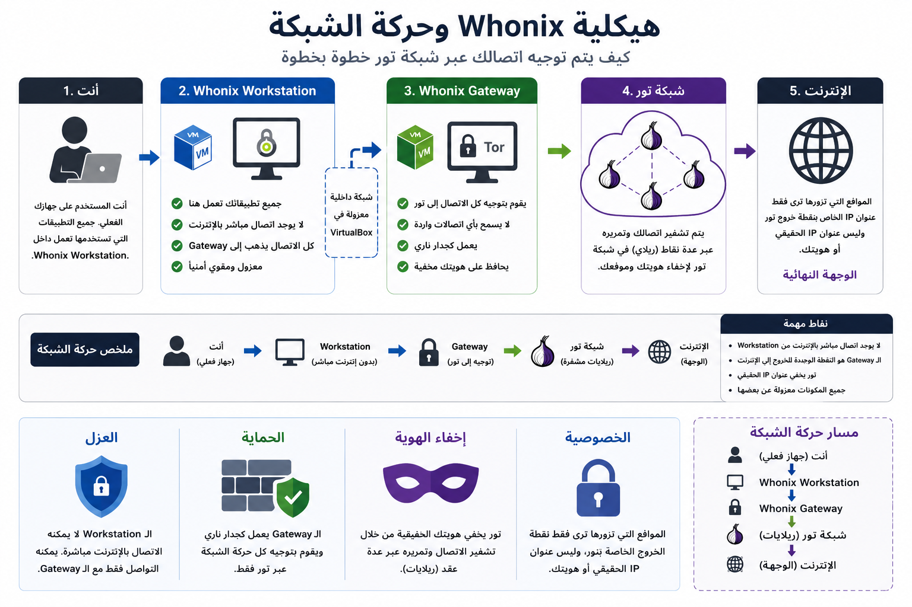
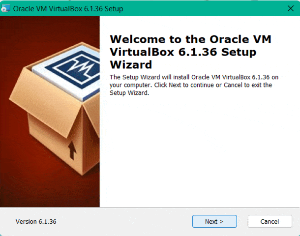

# دليل Whonix للمبتدئين

<p align="center">
  
</p>

<h1 align="center">دليل Whonix للمبتدئين</h1>

<p align="center">
  دليل مناسب للمبتدئين لفهم وتثبيت والتحقق من عمل Whonix بطريقة آمنة.
</p>

<p align="center">
  
  
  
  
  
</p>

---

## 🌐 اللغة
- 🇺🇸 [English](README.md)
- 🇸🇦 العربية

---

<p align="center">
  <a href="#عن-المشروع">عن المشروع</a> •
  <a href="#التثبيت">التثبيت</a> •
  <a href="#التحقق-باستخدام-wireshark">التحقق</a> •
  <a href="#نصائح-أمنية">نصائح أمنية</a> •
  <a href="#حل-المشاكل">حل المشاكل</a>
</p>

---

# عن المشروع

تم إنشاء هذا المشروع لمساعدة المبتدئين على فهم Whonix وبيئات الخصوصية بطريقة عملية ومرئية.

---

# ما هو Whonix؟

Whonix هو نظام تشغيل يركز على الخصوصية، مصمم لتوجيه جميع الاتصالات عبر شبكة Tor باستخدام جهازين وهميين معزولين:

- Whonix Gateway
- Whonix Workstation

```txt
المستخدم → Workstation → Gateway → Tor → الإنترنت
```

---
## نظرة على البنية الشبكية

<p align="center">
  
</p>
# التثبيت

## الخطوة 1 — تثبيت VirtualBox

الموقع الرسمي:
https://www.virtualbox.org

### مثال

<p align="center">
  
</p>

---

## الخطوة 2 — تحميل Whonix

التحميل الرسمي:
https://www.whonix.org/wiki/Download

قم بتحميل:
- Gateway
- Workstation

---

## الخطوة 3 — استيراد الأجهزة الوهمية

افتح:

```txt
File → Import Appliance
```

قم باستيراد:
- Gateway
- Workstation

### مثال


---

## الخطوة 4 — تشغيل Gateway أولًا

قم دائمًا بتشغيل:

1. Gateway
2. Workstation

---

# قائمة التثبيت

- [ ] تثبيت VirtualBox
- [ ] تحميل Whonix
- [ ] استيراد Gateway
- [ ] استيراد Workstation
- [ ] تشغيل Gateway
- [ ] التحقق من اتصال Tor
- [ ] تثبيت Wireshark
- [ ] تحليل الترافيك

---

# التحقق باستخدام Wireshark

يساعد Wireshark على التحقق من:
- اتصال Tor
- سلوك DNS
- حركة الحزم
- مسار الشبكة

---

## تثبيت Wireshark

الموقع الرسمي:
https://www.wireshark.org

التحميل:
https://www.wireshark.org/download.html

أثناء التثبيت:
- قم بتثبيت Npcap
- اترك الإعدادات الافتراضية

---

## بدء الالتقاط

1. افتح Wireshark
2. اختر كرت الشبكة النشط
3. ابدأ الالتقاط
4. افتح Tor Browser داخل Whonix

### مثال


---

# فلاتر مفيدة

## TCP

```txt
tcp
```

## DNS

```txt
dns
```

## Tor

```txt
tor
```

---

# جدول المقارنة

| الميزة | Whonix | Tor Browser | VPN |
|---|---|---|---|
| توجيه كامل للنظام | ✅ | ❌ | ❌ |
| عزل الاتصال | ✅ | ❌ | ❌ |
| فصل الهوية | ✅ | ❌ | ❌ |
| مناسب للمبتدئين | ⚠️ | ✅ | ✅ |

---

# نصائح أمنية

- حافظ على تحديث الأنظمة باستمرار
- استخدم كلمات مرور قوية
- تجنب التحميلات المشبوهة
- افصل بين الهويات المختلفة
- تجنب إضافات المتصفح العشوائية

---

# حل المشاكل

## لا يوجد اتصال بالإنترنت

الحلول الممكنة:
- إعادة تشغيل Gateway
- التحقق من إعدادات الشبكة في VirtualBox
- التأكد من اتصال الإنترنت الأساسي

---

## فشل اتصال Tor

الحلول الممكنة:
- مزامنة الوقت
- إعادة تشغيل Whonix
- التحقق من إعدادات الجدار الناري

---

# هيكل المشروع

```txt
whonix-beginner-guide/
│
├── README.md
├── README_AR.md
├── images/
├── verification/
├── troubleshooting/
└── resources/
```

---

# الأدوات الموصى بها

- https://www.whonix.org
- https://www.virtualbox.org
- https://www.wireshark.org
- https://www.torproject.org

---

# التطويرات المستقبلية

- [x] دليل التثبيت
- [x] التحقق باستخدام Wireshark
- [ ] شرح الشبكات المتقدم
- [ ] قسم OPSEC
- [ ] دمج Qubes OS

---

# إخلاء مسؤولية

هذا المشروع مخصص لأغراض تعليمية وتوعوية متعلقة بالخصوصية فقط.

---

# المطور

تم إنشاء المشروع بواسطة Feras Hamamdeh
